# 🎤 Trot_Master 개발 문서

## 📑 목차  

1. [📌 프로젝트 소개](#-프로젝트-소개)  

2. [🎯 개발 목표](#-개발-목표)  

3. [👨‍👨‍👦‍👦 팀원 소개](#-팀원-소개)  

4. [🛠 기술 스택](#-기술-스택)  

5. [📚 프로젝트 디렉토리 구조](#-프로젝트-디렉토리-구조)  

6. [🏗 시스템 구조도](#-시스템-구조도)  

7. [🛰️ 서비스 흐름도](#-서비스-흐름도)  

8. [🛢 스키마 ](#-스키마)

8. [💻 주요 기능](#-주요-기능)  

9. [🔍 트러블 슈팅](#-트러블-슈팅)  

10. [📈 성능 목표](#-성능-목표)  

11. [🔒 보안 고려사항](#-보안-고려사항)  

12. [📝 기술적 회고](#-기술적-회고)  

13. [🚀 향후 개선 계획](#-향후-개선-계획)  

## 📌 프로젝트 소개  
트로트 팬덤을 위한 올인원 플랫폼으로, 50-60대 사용자를 위한 최적화된 UI/UX를 제공하는 웹/앱 서비스입니다.  

### 💻 주요 기능  
이 서비스는 트로트 팬을 위한 **팬 커뮤니티 & 굿즈 거래 플랫폼**으로, 팬들이 좋아하는 가수와 소통하고 관련 상품을 거래할 수 있는 기능을 제공합니다.  

1. **🎤 팬 커뮤니티**  
   - 가수별 팬클럽 운영 (게시판, 댓글, 좋아요 기능)  
   - 팬 활동 랭킹 시스템 (게시글 작성, 좋아요, 이벤트 참여 등)  

2. **🛍️ 트로트 굿즈 마켓**  
   - 공식 굿즈 판매 (소속사 및 제작사와 제휴)  
   - 팬 간 비공식 굿즈 거래 중개  
   - 굿즈 리뷰 및 평가 시스템  

3. **💖 팬덤 활동 & 서포트 기능**  
   - 가수 후원 프로젝트 (커피차, 밥차 지원)  
   - 팬 기부 및 후원 랭킹 시스템  

4. **🎫 공연 & 이벤트**  
   - 트로트 공연 및 팬미팅 일정 제공  
   - 티켓 예매 사이트 연동  
   - 이벤트 알림 기능  

5. **📢 소셜 미디어 & 팬 참여 콘텐츠**  
   - 가수별 SNS 계정 연동 (인스타그램, 유튜브, 페이스북 등)  
   - 트로트 관련 뉴스, 신곡 발매 정보 제공  
   - 사용자 맞춤형 추천 시스템 (팬 활동 기반)  

## 🎯 서비스 목표  
- 직관적이고 접근성 높은 UI/UX 구현  
- 실시간 사용자 인터랙션을 위한 고성능 백엔드 시스템 구축  
- 안정적인 트래픽 처리를 위한 확장 가능한 인프라 설계  
- 사용자 데이터 기반의 추천 시스템 구현


## 📈 기술적 목표  
이 프로젝트의 개발 목표는 **Servlet과 JSP를 활용하여 MVC 패턴을 연습하고, 세션 기반 로그인 및 인증 시스템을 구현**하는 것입니다.  

1. **🌐 웹 애플리케이션 기본 구조 구현**  
   - Servlet + JSP를 활용한 **MVC 패턴 적용**  
   - Frontend와 Backend 간 **데이터 바인딩 및 요청 처리**  

2. **🔑 로그인 & 회원 관리**  
   - **Session 기반 로그인 구현**  
   - 회원가입 및 프로필 관리 기능  
   - 로그인 상태 유지 및 접근 권한 관리  

3. **📊 데이터베이스 설계 & 연동**  
   - MySQL 또는 Oracle DB를 활용한 **가수, 팬, 게시글, 굿즈 거래 데이터 관리**  
   - DAO (Data Access Object) 패턴을 적용하여 **데이터 접근 로직 분리**  

4. **📩 RESTful API 연습**  
   - 가수 정보, 게시글, 랭킹 등의 데이터를 가져오는 **RESTful API 설계**  
   - JSON 형식의 데이터 처리 및 클라이언트와의 연동  

5. **📷 파일 업로드 및 이미지 관리**  
   - 가수 프로필 이미지 업로드  
   - 게시판 내 이미지 첨부 기능  

6. **🔍 검색 및 필터링 기능**  
   - 가수/게시글/굿즈 검색 기능 구현  
   - 정렬 및 필터링을 통한 최적화된 사용자 경험 제공  

7. **⚡ AJAX & JavaScript 활용**  
   - 로그인/회원가입 시 실시간 유효성 검사  
   - AJAX를 활용한 비동기 데이터 로딩  

8. **📢 소셜 미디어 연동 & 공유 기능**  
   - 가수의 소셜 미디어 계정 자동 연동  
   - SNS 공유 버튼을 통한 팬 활동 활성화  


##  **💥최종 목표**  
이 프로젝트를 통해 Servlet과 JSP를 활용한 **MVC 패턴 기반 웹 애플리케이션을 구축하는 경험을 쌓고**,  
추후 Spring Framework를 도입하여 **더 확장성 있는 백엔드 구조를 학습하는 기반**을 다지는 것입니다. 🚀🔥


## 👨‍👨‍👦‍👦 팀원 소개  
|  |  |  |  |
| :---: | :---: | :---: | :---: |
| [유호준](https://github.com/wns5120) | [박재희](https://github.com/JaeHee-devSpace) | [이성빈](https://github.com/andytjdqls) | [김지훈](https://github.com/wild-turkey) |

## 🛠 기술 스택  


## 📚 프로젝트 디렉토리 구조  

(디렉토리 구조 설명 추가)  

## 🏗 시스템 구조도  

```mermaid
graph LR;
    A([🖥️ Client]) -->|Request| B[[🔀 Apache Tomcat]]
    B -->|Handles Request| C[[🟠 Servlet]]
    C -->|Processes Data| D{{📌 Controller}}
    D -->|Calls| E[[📂 Service Layer]]
    E -->|Uses| F[📜 DTO]
    E -->|Uses| G[⚙️ Util]
    E -->|Interacts| H[[📂 DAO]]
    H -->|Fetches Data| I[(🗄️ Oracle Database)]

    subgraph Frontend
        A
    end

    subgraph Backend
        B
        C
        D
        E
        F
        G
        H
    end

    subgraph Database
        I
    end

    style A fill:#2E8B57,stroke:#000,stroke-width:2px,color:#FFFFFF;
    style B fill:#1E90FF,stroke:#000,stroke-width:2px,color:#FFFFFF;
    style C fill:#FFA500,stroke:#000,stroke-width:2px,color:#000000;
    style D fill:#FFD700,stroke:#000,stroke-width:2px,color:#000000;
    style E fill:#DC143C,stroke:#000,stroke-width:2px,color:#FFFFFF;
    style F fill:#8A2BE2,stroke:#000,stroke-width:2px,color:#FFFFFF;
    style G fill:#654321,stroke:#000,stroke-width:2px,color:#FFFFFF;
    style H fill:#4169E1,stroke:#000,stroke-width:2px,color:#FFFFFF;
    style I fill:#8B4513,stroke:#000,stroke-width:2px,color:#FFFFFF;
```


<details>
    <summary>Memaid 코드</summary>


</details>

## 🛰️ 서비스 흐름도  

```mermaid
graph TD;
    A["사용자"] -->|"회원가입 / 로그인"| B["🏠 메인 화면 - 트로트 가수 선택"];

    %% 🎤 팬 활동
    subgraph C["🎤 팬 활동"]
        C1["🎭 팬 커뮤니티"] -->|"게시글 작성"| C2["📝 게시판"];
    end
    
    %% 🛍️ 거래 시스템
    subgraph D["🛍️ 거래 시스템"]
        D1["🎁 굿즈 마켓"] -->|"상품 등록 / 거래"| D2["💳 거래 시스템"];
    end

    %% 💖 후원 시스템
    subgraph E["💖 후원 시스템"]
        E1["🌟 후원 프로젝트"] -->|"포인트 결제"| E2["💰 결제 시스템"];
    end
    
    %% 🎫 공연 & 이벤트
    subgraph F["🎫 공연 & 이벤트"]
        F1["🎵 공연 일정 & 예매"] -->|"티켓 예매"| F2["🎟️ 예매 시스템"];
    end
    
    %% 메인 화면에서 각 시스템으로 연결 (서브그래프 전체에 연결)
    B --> C;
    B --> D;
    B --> E;
    B --> F;

    %% 💡 스타일 적용 (전체 테두리 색상을 파란색으로 변경)
    style A fill:#ffffff,stroke:#1E90FF,stroke-width:2px;
    style B fill:#ffffff,stroke:#1E90FF,stroke-width:2px;
    style C fill:#ffffff,stroke:#1E90FF,stroke-width:2px;
    style D fill:#ffffff,stroke:#1E90FF,stroke-width:2px;
    style E fill:#ffffff,stroke:#1E90FF,stroke-width:2px;
    style F fill:#ffffff,stroke:#1E90FF,stroke-width:2px;
    style C1 fill:#ffffff,stroke:#1E90FF,stroke-width:2px;
    style C2 fill:#ffffff,stroke:#1E90FF,stroke-width:2px;
    style D1 fill:#ffffff,stroke:#1E90FF,stroke-width:2px;
    style D2 fill:#ffffff,stroke:#1E90FF,stroke-width:2px;
    style E1 fill:#ffffff,stroke:#1E90FF,stroke-width:2px;
    style E2 fill:#ffffff,stroke:#1E90FF,stroke-width:2px;
    style F1 fill:#ffffff,stroke:#1E90FF,stroke-width:2px;
    style F2 fill:#ffffff,stroke:#1E90FF,stroke-width:2px;

    %% 💡 화살표 스타일 조정 (글자를 가리지 않도록 곡선 적용)
    linkStyle 0,1,2,3 stroke:#1E90FF,stroke-width:2px,curve:basis;
```
  

<details>
    <summary>Memaid 코드</summary>


</details>

## 🛢 스키마  

**Oracle DB**를 활용하여 **가수, 팬, 게시글, 굿즈 거래 데이터**를 저장하고 관리합니다.  

- **User**: 사용자 정보 관리  
- **Singer**: 가수 프로필 및 활동 정보  
- **Point**: 팬 활동 포인트 시스템  
- **Post**: 팬 커뮤니티 게시글  
- **Comment**: 게시글 댓글  
- **Calendar**: 가수 일정 및 이벤트  
- **Goods**: 트로트 굿즈 및 거래 정보 

<details>
    <summary> 🚟 Table 구조</summary>

### 1. **User (사용자 정보)**

| 컬럼명 | 데이터 타입 | 설명 |
| --- | --- | --- |
| user_id | INT | 사용자 고유 ID (Primary Key) |
| username | VARCHAR(100) | 사용자 이름 |
| email | VARCHAR(100) | 이메일 |
| password | VARCHAR(255) | 비밀번호 |
| phone | VARCHAR(15) | 전화번호 |
| created_at | TIMESTAMP | 계정 생성 일시 |
| updated_at | TIMESTAMP | 계정 정보 마지막 수정 일시 |

  

### 2. **Singer (가수 정보)**

| 컬럼명 | 데이터 타입 | 설명 |
| --- | --- | --- |
| singer_id | INT | 가수 고유 ID (Primary Key) |
| name | VARCHAR(100) | 가수 이름 |
| debut_date | DATE | 데뷔 일자 |
| social_media | TEXT | SNS 링크 등 (JSON 형태로 저장 가능) |
| created_at | TIMESTAMP | 정보 등록 일시 |
| updated_at | TIMESTAMP | 정보 수정 일시 |
| total_point | INT | 가수 총합 활동 포인트 |
| birth_date | DATE | 생년월일 |
| image_url | VARCHAR(500) | 가수 프로필 이미지 URL |

  

### 2-1. Point - 활동 포인트 테이블

| 컬럼명 | 데이터 타입 | 설명 |
| --- | --- | --- |
| activity_id | INT | 활동 고유 ID (Primary Key) |
| user_id | INT | 사용자 고유 ID  |
| singer_id | INT | 가수 고유 ID  |
| point | INT | 활동 포인트  |
| created_at | TIMESTAMP | 정보 등록 일시 |


### 3. **Post (게시판 - 팬클럽 & 콘서트)**

| 컬럼명 | 데이터 타입 | 설명 |
| --- | --- | --- |
| post_id | INT | 게시글 고유 ID (Primary Key) |
| singer_id | INT | 가수 ID (Foreign Key) |
| user_id | INT | 사용자 ID (Foreign Key)  |
| title | VARCHAR(200) | 게시글 제목 |
| content | TEXT | 게시글 내용 |
| created_at | TIMESTAMP | 게시글 작성 일시 |
| updated_at | TIMESTAMP | 게시글 수정 일시 |


### 4. **Comment (게시판 댓글)**

| 컬럼명 | 데이터 타입 | 설명 |
| --- | --- | --- |
| comment_id | INT | 댓글 고유 ID (Primary Key) |
| post_id | INT | 게시글 ID (Foreign Key) |
| user_id | INT | 댓글 작성자 ID (Foreign Key) |
| content | TEXT | 댓글 내용 |
| created_at | TIMESTAMP | 댓글 작성 일시 |
| updated_at | TIMESTAMP | 댓글 수정 일시 |


### 5. **Calendar (가수 일정 정보)**

| 컬럼명 | 데이터 타입 | 설명 |
| --- | --- | --- |
| schedule_id | INT | 일정 고유 ID (Primary Key) |
| singer_id | INT | 가수 ID (Foreign Key) |
| event_title | VARCHAR(200) | 일정 제목 |
| event_date | DATE | 일정 날짜 |
| event_time | TIME | 일정 시간 |
| event_type | VARCHAR(100) | 일정 유형 (팬미팅, 콘서트 등) |
| location | VARCHAR(255) | 일정 장소 |
| created_at | TIMESTAMP | 일정 등록 일시 |
| updated_at | TIMESTAMP | 일정 수정 일시 |


### 6. **Goods (굿즈 정보)**

| 컬럼명 | 데이터 타입 | 설명 |
| --- | --- | --- |
| goods_id | INT | 굿즈 고유 ID (Primary Key) |
| singer_id | INT | 가수 ID (Foreign Key) |
| name | VARCHAR(100) | 굿즈 이름 |
| description | TEXT | 굿즈 설명 |
| price | DECIMAL(10, 2) | 가격 |
| stock_qty | INT | 재고 수량 |
| goods_type | VARCHAR(3) | 공식/비공식 타입 |
| created_at | TIMESTAMP | 굿즈 등록 일시 |
| updated_at | TIMESTAMP | 굿즈 수정 일시 |


</details>

## ⚠ 트러블 슈팅  

<details>
  <summary>📂 Singer.jsp 경로 문제</summary>

### ✅ **오류 상황**  
> `http://localhost:8080/trot_master/Singer.jsp?id=1` 접근 시 **"HTTP 상태 404 - 찾을 수 없음"** 오류 발생  

### ❌ **원인 분석**  
1. `Singer.jsp` 파일이 **경로에 존재하지 않거나, 파일명이 다를 가능성**  
2. 요청을 처리하는 `SingerController`에서 `request.getRequestDispatcher("Singer.jsp").forward(request, response);` 호출 시 **파일이 해당 위치에 없을 가능성**  
3. `web.xml` 또는 `@WebServlet` 설정에서 올바른 매핑이 되지 않았을 가능성  

### 🛠 **해결 방법**  
✅ `Singer.jsp` 파일이 `webapp` 디렉토리 아래에 존재하는지 확인  
✅ 파일명이 대소문자가 정확히 일치하는지 확인 (`singer.jsp` → `Singer.jsp` 오타 체크)  
✅ 컨트롤러에서 `request.getRequestDispatcher("/Singer.jsp").forward(request, response);` 와 같이 **절대 경로 사용**  
✅ Tomcat을 **클린 빌드 후 재배포**하여 변경 사항을 반영  

### ⚡ **적용 과정**  
1. 프로젝트 디렉토리 구조를 확인하여 `webapp/Singer.jsp` 파일이 존재하는지 확인  
2. `SingerController`에서 `getRequestDispatcher()` 메서드 호출 시 경로 수정  
3. Tomcat 서버 재시작 및 캐시 정리 후 테스트  

</details>

---

<details>
  <summary>📂 HTTP 요청 헤더 오류 해결</summary>

### ✅ **오류 상황**  
> `java.lang.IllegalArgumentException: 요청 타겟에서 유효하지 않은 문자가 발견되었습니다.`  

### ❌ **원인 분석**  
1. `openSingerProfile(singerId)` 함수에서 **URL에 잘못된 문자가 포함되었을 가능성**  
2. `Singer.jsp` 호출 시 `?id=1` 대신 잘못된 형식의 쿼리 문자열이 포함될 가능성  

### 🛠 **해결 방법**  
✅ `openSingerProfile(singerId)`에서 `Singer.jsp?id=1` 호출 시 **올바른 URL 인코딩** 적용  
✅ URL 호출 시 파라미터 값이 **숫자인지** 확인하고 `encodeURIComponent()` 사용  

### ⚡ **적용 과정**  
```javascript
function openSingerProfile(singerId) {
    let url = "Singer.jsp?id=" + encodeURIComponent(singerId);
    let popup = window.open(url, "SingerProfile", "width=800,height=600,scrollbars=yes");
    if (popup) popup.focus();
}
```
</details>

---

<details>
    <summary>📂 가수 랭킹 데이터 미출력 문제</summary>

### ✅ **오류 상황** 
> 'topSingers 데이터가 정상적으로 조회되지 않고 (⚠️ 데이터 없음) 메시지만 출력됨'

### ❌ **원인 분석**  
1. getTopSingersByPoint()에서 DB에서 데이터를 정상적으로 가져오지 못하는 경우<br>
2. request.setAttribute("topSingers", topSingers); 호출이 제대로 전달되지 않은 경우<br>
3. JSP에서 c:forEach를 사용하여 리스트를 순회할 때 null이거나 빈 리스트일 가능성

### **🛠 해결 방법**
✅ SingerDAO.getTopSingersByPoint()에서 쿼리 실행 여부 확인 <br>
✅ request.getAttribute("topSingers") 값이 JSP에서 올바르게 출력되는지 디버깅 <br>
✅ JSP에서 c:if test="${empty topSingers}" 조건을 추가하여 오류 출력

### ⚡ **적용 과정**  

1. DAO 디버깅 코드 추가
```java
List<String> singers = new ArrayList<>();
String query = "SELECT name, total_point FROM Singer ORDER BY total_point DESC";

try (Connection conn = DBUtil.getConnection();
     PreparedStatement pstmt = conn.prepareStatement(query);
     ResultSet rs = pstmt.executeQuery()) {

    while (rs.next()) {
        singers.add(rs.getString("name") + " - " + rs.getInt("total_point") + "점");
    }

    if (singers.isEmpty()) {
        System.out.println("⚠️ 데이터 없음 - 쿼리 결과 없음");
    } else {
        System.out.println("✅ 데이터 로드 성공: " + singers);
    }

} catch (Exception e) {
    e.printStackTrace();
}
```

JSP 디버깅 추가
```jsp
<c:choose>
    <c:when test="${empty topSingers}">
        <li>⚠️ 데이터 없음</li>
    </c:when>
    <c:otherwise>
        <c:forEach var="topSinger" items="${topSingers}">
            <li>${topSinger}</li>
        </c:forEach>
    </c:otherwise>
</c:choose>
```
</details>

---

<details> 
<summary>📂 소셜 미디어 정보 없음 문제</summary>

### ✅ **오류 상황**  
>singer.socialMedia 값이 DB에 저장되어 있음에도 "소셜 미디어 정보 없음"이 표시됨

### ❌ **원인 분석** 
1. singer.getSocialMedia()가 null이거나 빈 문자열인 경우 <br>
2. JSON 데이터가 String으로 저장되어 있어 JSP에서 Map<String, String> 형태로 변환되지 않은 경우 <br>
3. JSP에서 socialMediaMap을 처리할 때 EL (Expression Language)와 스크립틀릿(<% %>) 코드 혼용 문제 <br>

### 🛠 **해결 방법**  
✅ SingerController에서 Gson을 이용하여 JSON을 Map<String, String> 으로 변환하여 전달 <br>
✅ JSP에서 socialMediaMap을 올바르게 처리

### ⚡ **적용 과정**  
1. Controller에서 JSON을 변환하여 request에 저장
``` java
// 소셜 미디어 JSON을 Map<String, String>으로 변환
String socialMediaJson = singer.getSocialMedia();
Map<String, String> socialMediaMap = null;

if (socialMediaJson != null && !socialMediaJson.isEmpty()) {
    try {
        Gson gson = new Gson();
        Type type = new TypeToken<Map<String, String>>() {}.getType();
        socialMediaMap = gson.fromJson(socialMediaJson, type);
    } catch (Exception e) {
        e.printStackTrace();
    }
}

// ✅ JSP에서 사용 가능하도록 request에 저장
request.setAttribute("socialMediaMap", socialMediaMap);
```

2. JSP에서 올바르게 출력하도록 수정
```jsp
<p id="profile-social">📍 소셜 미디어:
    <c:choose>
        <c:when test="${empty socialMediaMap}">
            소셜 미디어 정보 없음
        </c:when>
        <c:otherwise>
            <c:forEach var="entry" items="${socialMediaMap}">
                <a href="${entry.value}" target="_blank">${entry.key}</a>
            </c:forEach>
        </c:otherwise>
    </c:choose>
</p>
```
</details>

## 🔒 보안 고려사항  

(보안 관련 설명 추가)  

## 🙂 프로젝트 회고  

(개발 과정에서의 회고 추가)  

## 🚀 향후 개선 계획  

(개선 계획 추가)  


