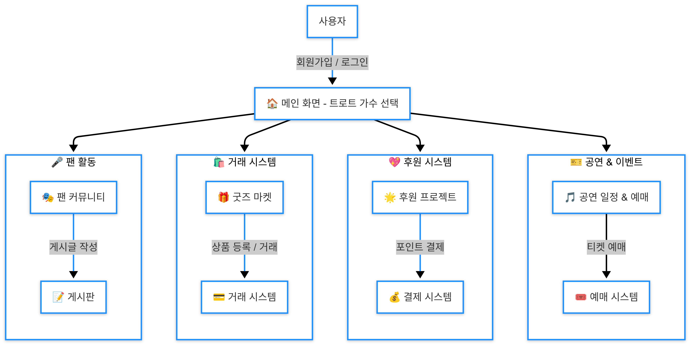

# 🎤 Trot_Master 개발 문서

## 📌 프로젝트 소개
트로트 팬덤을 위한 올인원 플랫폼으로, 50-60대 사용자를 위한 최적화된 UI/UX를 제공하는 웹/앱 서비스입니다.

## 🎯 개발 목표
- 직관적이고 접근성 높은 UI/UX 구현
- 실시간 사용자 인터랙션을 위한 고성능 백엔드 시스템 구축
- 안정적인 트래픽 처리를 위한 확장 가능한 인프라 설계
- 사용자 데이터 기반의 추천 시스템 구현

## 👨‍👨‍👦‍👦 팀원 소개
|  |  |  |  |
| :---: | :---: | :---: | :---: |
| [유호준](https://github.com/wns5120) | [박재희](https://github.com/JaeHee-devSpace) | [이성빈](https://github.com/andytjdqls) | [김지훈](https://github.com/wild-turkey) |

## 🛠 기술 스택

## 🏗 시스템 구조도

## 💻 주요 구현 기능

## 🔍 트러블 슈팅

## 📈 성능 목표

## 🔒 보안 고려사항

## 📝 기술적 회고

## 🚀 향후 개선 계획

**🛰️ 서비스 흐름도**

