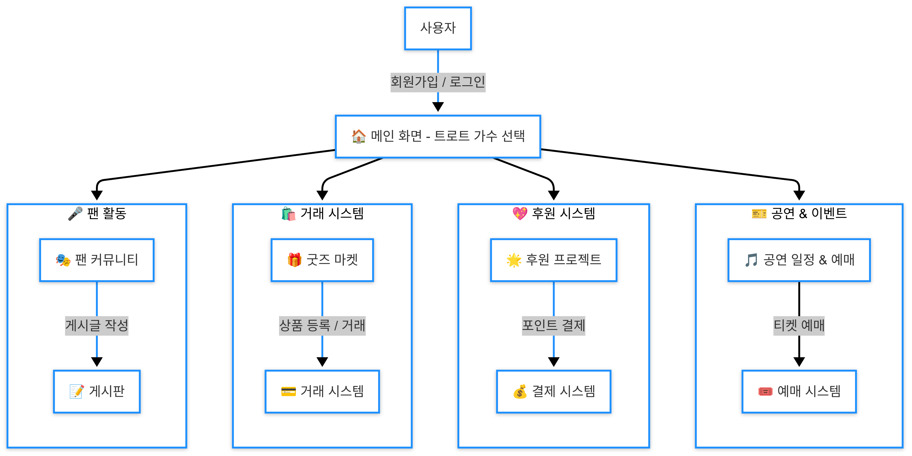

## 📑 목차

0. [ 👨‍💻 개발 스토리](#--0-개발-스토리)    [바로가기](/Develop_README.md)
1. [🌟 트로트 팬 플랫폼 서비스 개요](#-1-트로트-팬-플랫폼-trot_master-서비스-개요)
2. [📊 시장 분석](#-2-시장-분석)
   - 데이터 인사이트
   - 타겟 시장 & 고객 분석
   - 경쟁사 분석 & 차별화 전략
3. [💰 수익 모델](#-3-수익-모델-revenue-model)
4. [🚀 서비스 차별화 & 브랜딩 전략](#-4-서비스-차별화--브랜딩-전략)
5. [🏗️ 서비스 개발 및 운영 전략](#️-5-서비스-개발-및-운영-전략)
6. [📢 마케팅 & 홍보 전략](#-6-마케팅--홍보-전략)
7. [📈 예상 매출 & 재무 계획](#-7-예상-매출--재무-계획)
8. [⚠️ 리스크 분석 & 대응 전략](#️-8-리스크-분석--대응-전략)
9. [💥 최종 결론](#-최종-결론)
10. [🎨 UI/UX 디자인](#-9-uiux-디자인-서비스-화면-예시)

## 👨‍💻  0. 개발 스토리

  

## 🌟 1. 트로트 팬 플랫폼 [Trot_Master] 서비스 개요

 

**🎯 목적**  
50~60대 트로트 팬을 위한 팬덤 커뮤니티 & 굿즈 거래 플랫폼 구축  
쉽고 직관적인 UI 제공으로 시니어층의 접근성을 높임  
 

**🔥 핵심 기능**  
🎤 **팬 커뮤니티** → 가수별 팬클럽 운영, 팬 활동 랭킹  
🛍️ **트로트 굿즈 마켓** → 비공식 굿즈 제작 중개 & 공식 굿즈 판매  
💖 **활동 포인트 & 서포트** → 커피차, 밥차 후원 프로젝트  
🎫 **공연 & 이벤트** → 예매 사이트 연계 & 일정 알림 기능

 

**🛰️ 서비스 흐름도**

 
 

## 📊 2. 시장 분석
 

### 👁‍🗨 데이터 인사이트

 

### 🎯 타겟 시장 & 고객 분석  
- **50~60대 트로트 팬덤 증가** (미스터트롯/미스트롯 성공 사례)  
- **디지털 플랫폼 활용 증가** (유튜브, 네이버 밴드, 카카오톡 등)  

 

### 🔍 경쟁사 분석 & 차별화 전략  
 

| 플랫폼 | 주요 기능 | 차별화 가능성 |
|-----|---|---|
| 🎥 유튜브 | 트로트 콘텐츠 多 | 팬 커뮤니티 기능 없음 |
| 🎵 멜론/벅스 | 트로트 스트리밍 지원 | 팬 참여 기능 부족 |
| 🏘️ 네이버 밴드 | 시니어 모임 가능 | 트로트 특화 X |
| 🎬 트로트 유튜브 채널 | 전용 콘텐츠 | 커뮤니티 & 굿즈 기능 없음 |
| 🛒 굿즈 판매몰 (예: 스마트스토어) | 트로트 관련 굿즈 판매 가능 | 팬덤 중심의 중개 시스템 없음 |
| 🎟️ 콘서트 티켓 정보 제공 사이트 (예: 인터파크, 멜론 티켓) | 트로트 공연 예매 가능 | 팬덤 맞춤형 추천 기능 부족 |

 

💡 **차별화 요소**  
- 🎯 **50~60대 맞춤 UI 제공**  (큰 글씨 + 직관적인 인터페이스)  
- 🎶 **트로트 팬덤 중심의 기능 최적화** (팬클럽 운영, 굿즈, 이벤트 관리)  
- 🌍 **온라인 + 오프라인 연결** (콘서트, 이벤트, 팬미팅 연계)  

 

## 💰 3. 수익 모델 (Revenue Model)

 

| 💸 수익 모델 | 설명 |
|---|---|
| ⭐ **프리미엄 멤버십 (월 구독)** | 광고 제거, 독점 콘텐츠, VIP 팬클럽 기능 |
| 📦 **비공식 굿즈 중개 수수료** | 개인 간 굿즈 거래 시 수수료 부과 |
| 🏷️ **공식 굿즈 판매 수익** | 소속사 및 제작사와 제휴하여 굿즈 판매 |
| 💵 **모금 프로젝트 수수료** | 팬 모금 활동 시 플랫폼 수수료 적용 |
| 📢 **광고 (음악/공연/브랜드 광고)** | 트로트 브랜드 및 공연 광고 연계 |
| 🎥 **온라인 콘서트 & 팬미팅** | 유료 스트리밍, VOD 콘텐츠 제공 |

---

 

## 🚀 4. 서비스 차별화 & 브랜딩 전략

🎤 **팬 커뮤니티 강화** → 게시판, 랭킹 시스템, 후원 기능  
🖥️ **트로트 맞춤형 UI 제공** → 50~60대 사용성을 고려한 심플한 인터페이스  
📰 **트로트 뉴스 & 최신 정보 제공** → 가수 소식, 신곡 발매 일정, 방송 출연 정보  
🔎 **맞춤형 추천 시스템** → 관심 가수 기반 뉴스 & 굿즈 & 공연 추천  

  

## 🏗️ 5. 서비스 개발 및 운영 전략

### 📌 MVP(최소 기능 제품) 출시 계획

#### **📅 1차 출시 (0~6개월)**
- 기본 팬 커뮤니티 & 게시판  
- 트로트 굿즈 중개 기능  
- 콘서트 일정 알림 서비스  

#### **📅 2차 확장 (6~12개월)**
- 팬클럽 멤버십 (유료 기능 추가)  
- 가수 후원 기능 도입  

#### **📅 3차 확장 (12~24개월)**
- 트로트 굿즈 공식 판매 연계  
- 지역 오프라인 이벤트 & 공연 연계  
- 해외 트로트 팬 커뮤니티 확장  

  

## 📢 6. 마케팅 & 홍보 전략

📱 **SNS 광고 & 인플루언서 협업** → 네이버 밴드, 유튜브 트로트 채널 활용  
📺 **트로트 가수 & 방송 프로그램과 협업** → TV조선, KBS 트로트 관련 방송 연계  
🎭 **오프라인 이벤트 & 팬미팅 연계** → 지역별 공연 & 팬 행사 주최  

  

## 📈 7. 예상 매출 & 재무 계획

### 💰 초기 투자 비용
- **플랫폼 개발 (앱 & 웹):** 약 5억 원  
- **콘텐츠 확보 (저작권, 라이선스 비용):** 약 2억 원  
- **마케팅 & 광고비:** 약 1억 원  

### 📊 수익 예측

| 연도 | 예상 가입자 수 | 매출 예상 |
|---|---|---|
| 1년 차 | 10만 명 | 5억 원 |
| 2년 차 | 30만 명 | 20억 원 |
| 3년 차 | 50만 명 | 50억 원 |

  

## ⚠️ 8. 리스크 분석 & 대응 전략

🛑 **트로트 시장 변화** → 신인 가수 발굴 & 다양한 콘텐츠 확보  
⚖️ **저작권 문제** → 음원 플랫폼 & 소속사 제휴 강화  
📢 **사용자 유입 저조** → TV광고, 유튜버 협업, 오프라인 이벤트 연계  

  

## 💥 최종 결론

🎶 **트로트 + SNS + 커머스 결합한 올인원 플랫폼 구축**  
💰 **프리미엄 멤버십, 광고, 공연 예매, 굿즈 판매 등 다각적인 수익 모델 확보**  
🚀 **유튜브 & 네이버 밴드와 차별화된 팬덤 중심 서비스로 확장 가능**  

### 📌 다음 단계:
✅ **초기 서비스 기획 마무리 (MVP 결정)**  
✅ **투자 유치를 위한 자료 준비 (수익 모델 & 예상 매출 강조)**  
✅ **파일럿 서비스 개발 (초기 버전 MVP 제작 후 시장 반응 확인)**  

  

## 🎨 9. UI/UX 디자인 (서비스 화면 예시)

🔹 **홈 화면**  
- 추천 트로트 콘텐츠 및 핫한 팬 커뮤니티 게시글 노출  

🔹 **팬 커뮤니티**  
- 가수별 팬클럽 페이지  
- 게시판 & 팬 랭킹 시스템  

🔹 **트로트 굿즈 마켓**  
- 공식 굿즈 판매  
- 팬들이 직접 거래하는 비공식 굿즈 중개  

🔹 **공연 & 이벤트 페이지**  
- 콘서트 일정 조회 및 예매 연동  
- 팬미팅 이벤트 신청 기능  

📌 **UI 디자인 미리보기**  

  

